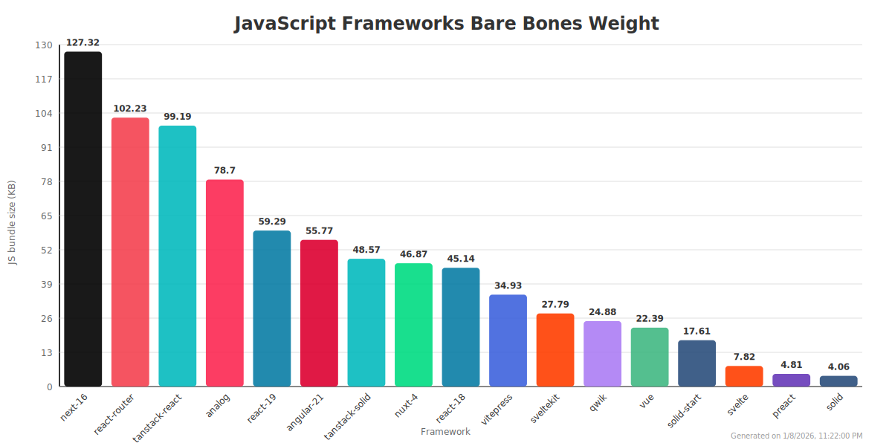

# JavaScript Frameworks Bundle Size Benchmark

_aka: what framework should I use for a static website ?_

## Disclaimers

- All mentioned frameworks are great. Some are just better suited for complex apps and a bit overkill for simple websites.
- I'm not sure I will maintain this repo with future versions. Check if the versions used are still relevant when you read this.

## Motivation

I always pay attention to the bundle size of my apps and websites, for performance and environmental sustainability reasons. In a large and dynamic app, a lot of JavaScript code is often needed for the many features. But in static websites, it mostly comes from the frameworks and libraries used (if there is a lot of JavaScript code in a static website it's probably not necessary, otherwise it's probably not a static website).

In that regard, I wanted to quantify the impact of each modern framework in terms of bundle size.

## Methodology

With each framework, I created an app that renders a single blank page. I only kept the code that would typically be used in a real world app (routing, SEO tags, error handling etc). I used SSG when available, otherwise a regular SPA. Then, I built each app for production and measured the size of the generated JavaScript bundle.

I compressed the files because I'm used to gzipped numbers, but the relative difference with uncompressed files is not huge. The downside is that there might be a difference of a few KB between the numbers on the graph and what we see in a browser due to different compression algorithms.

## Results

## Features

The following table compares key structural features across all frameworks. Frameworks are ordered by bundle size (largest to smallest).

| Framework | [SSG](https://en.wikipedia.org/wiki/Static_site_generator) | [SSR](https://en.wikipedia.org/wiki/Server-side_scripting) | [Streaming SSR](https://nextjs.org/docs/app/building-your-application/routing/loading-ui-and-streaming) | [API Routes](https://nextjs.org/docs/pages/building-your-application/routing/api-routes) | [Server Actions](https://react.dev/reference/rsc/server-actions) | [File-based Routing](https://nextjs.org/docs/app/building-your-application/routing/defining-routes) | [Code Splitting](https://developer.mozilla.org/en-US/docs/Glossary/Code_splitting) |
|-----------|-----|-----|---------------|------------|----------------|-------------------|---------------|
| [Next.js 16](https://nextjs.org/) | [✅](https://nextjs.org/docs/pages/building-your-application/rendering/static-site-generation) | [✅](https://nextjs.org/docs/pages/building-your-application/rendering/server-side-rendering) | [✅](https://nextjs.org/docs/app/building-your-application/routing/loading-ui-and-streaming) | [✅](https://nextjs.org/docs/pages/building-your-application/routing/api-routes) | [✅](https://nextjs.org/docs/app/building-your-application/data-fetching/server-actions-and-mutations) | [✅](https://nextjs.org/docs/app/building-your-application/routing/defining-routes) | [✅](https://nextjs.org/docs/app/building-your-application/optimizing/lazy-loading) |
| [React Router](https://reactrouter.com/) | [⚠️](https://reactrouter.com/start/framework/data-loading#static-pre-rendering) | [✅](https://reactrouter.com/start/framework/rendering-strategies) | [✅](https://reactrouter.com/start/framework/rendering-strategies#streaming) | [⚠️](https://reactrouter.com/start/framework/actions) | [✅](https://reactrouter.com/start/framework/actions) | [✅](https://reactrouter.com/start/framework/routing) | [✅](https://reactrouter.com/start/library/code-splitting) |
| [TanStack Start (React)](https://tanstack.com/start) | [✅](https://tanstack.com/start/latest/docs/framework/react/guide/static-site-generation) | [✅](https://tanstack.com/start/latest/docs/framework/react/guide/server-side-rendering) | [✅](https://tanstack.com/start/latest/docs/framework/react/guide/streaming) | [✅](https://tanstack.com/start/latest/docs/framework/react/api-routes) | [✅](https://tanstack.com/start/latest/docs/framework/react/guide/server-functions) | [✅](https://tanstack.com/start/latest/docs/framework/react/guide/file-based-routing) | [✅](https://tanstack.com/router/latest/docs/framework/react/guide/code-splitting) |
| [Analog](https://analogjs.org/) | [✅](https://analogjs.org/docs/features/data-fetching/server-side-data-fetching) | [✅](https://analogjs.org/docs/features/server/server-side-rendering) | [❌](https://analogjs.org/docs/features/server/server-side-rendering) | [✅](https://analogjs.org/docs/features/api/overview) | [❌](https://analogjs.org/docs) | [✅](https://analogjs.org/docs/features/routing/overview) | [✅](https://angular.dev/guide/ngmodules/lazy-loading) |
| [React 19](https://react.dev/) | [❌](https://react.dev/learn) | [❌](https://react.dev/learn) | [❌](https://react.dev/learn) | ❌ | [⚠️](https://react.dev/reference/rsc/use-server) | ❌ | [⚠️](https://react.dev/reference/react/lazy) |
| [Angular 21](https://angular.dev/) | [⚠️](https://angular.dev/guide/prerendering) | [✅](https://angular.dev/guide/ssr) | [❌](https://angular.dev/guide/ssr) | ❌ | ❌ | ❌ | [✅](https://angular.dev/guide/ngmodules/lazy-loading) |
| [TanStack Start (Solid)](https://tanstack.com/start) | [✅](https://tanstack.com/start/latest/docs/framework/solid/guide/static-site-generation) | [✅](https://tanstack.com/start/latest/docs/framework/solid/guide/server-side-rendering) | [✅](https://tanstack.com/start/latest/docs/framework/solid/guide/streaming) | [✅](https://tanstack.com/start/latest/docs/framework/solid/api-routes) | [✅](https://tanstack.com/start/latest/docs/framework/solid/guide/server-functions) | [✅](https://tanstack.com/start/latest/docs/framework/solid/guide/file-based-routing) | [✅](https://tanstack.com/router/latest/docs/framework/solid/guide/code-splitting) |
| [Nuxt 4](https://nuxt.com/) | [✅](https://nuxt.com/docs/guide/concepts/rendering#static-site-generation) | [✅](https://nuxt.com/docs/guide/concepts/rendering#server-side-rendering) | [⚠️](https://nuxt.com/docs/guide/concepts/rendering#hybrid-rendering) | [✅](https://nuxt.com/docs/guide/directory-structure/server) | [✅](https://nuxt.com/docs/guide/directory-structure/server#server-routes) | [✅](https://nuxt.com/docs/getting-started/routing) | [✅](https://nuxt.com/docs/guide/concepts/code-splitting) |
| [React 18](https://react.dev/) | [❌](https://react.dev/learn) | [❌](https://react.dev/learn) | [❌](https://react.dev/learn) | ❌ | ❌ | ❌ | [⚠️](https://react.dev/reference/react/lazy) |
| [VitePress](https://vitepress.dev/) | [✅](https://vitepress.dev/guide/what-is-vitepress) | [✅](https://vitepress.dev/guide/ssr-compat) | [❌](https://vitepress.dev/guide/ssr-compat) | ❌ | ❌ | [⚠️](https://vitepress.dev/guide/routing) | [✅](https://vitepress.dev/guide/performance) |
| [SvelteKit](https://svelte.dev/docs/kit) | [✅](https://svelte.dev/docs/kit/page-options#prerender) | [✅](https://svelte.dev/docs/kit/page-options#ssr) | [✅](https://svelte.dev/docs/kit/load#streaming-with-promises) | [✅](https://svelte.dev/docs/kit/routing#server) | [✅](https://svelte.dev/docs/kit/form-actions) | [✅](https://svelte.dev/docs/kit/routing) | [✅](https://svelte.dev/docs/kit/performance#code-splitting) |
| [Qwik](https://qwik.dev/) | [✅](https://qwik.dev/docs/guides/static-site-generation/) | [✅](https://qwik.dev/docs/guides/qwik-city/) | [✅](https://qwik.dev/docs/advanced/streaming/) | [✅](https://qwik.dev/docs/guides/endpoints/) | [✅](https://qwik.dev/docs/guides/server$/) | [✅](https://qwik.dev/docs/guides/routing/) | [✅](https://qwik.dev/docs/advanced/modules-prefetching/) |
| [Vue 3](https://vuejs.org/) | [❌](https://vuejs.org/guide/introduction.html) | [⚠️](https://vuejs.org/guide/scaling-up/ssr.html) | [❌](https://vuejs.org/guide/scaling-up/ssr.html) | ❌ | ❌ | ❌ | [⚠️](https://vuejs.org/guide/components/async.html) |
| [SolidStart](https://start.solidjs.com/) | [✅](https://start.solidjs.com/core-concepts/static-site-generation) | [✅](https://start.solidjs.com/core-concepts/server-side-rendering) | [✅](https://docs.solidjs.com/guides/how-to-guides/streaming/overview) | [✅](https://start.solidjs.com/api/server) | [✅](https://start.solidjs.com/core-concepts/actions) | [✅](https://start.solidjs.com/core-concepts/routing) | [✅](https://docs.solidjs.com/guides/how-to-guides/routing-in-solid-router/lazy-loading-routes) |
| [Svelte](https://svelte.dev/) | [❌](https://svelte.dev/docs/introduction) | [❌](https://svelte.dev/docs/introduction) | [❌](https://svelte.dev/docs/introduction) | ❌ | ❌ | ❌ | ❌ |
| [Preact](https://preactjs.com/) | [❌](https://preactjs.com/guide/v10/getting-started) | [⚠️](https://preactjs.com/guide/v10/server-side-rendering) | [❌](https://preactjs.com/guide/v10/server-side-rendering) | ❌ | ❌ | ❌ | [⚠️](https://preactjs.com/guide/v10/lazy-loading) |
| [Solid](https://www.solidjs.com/) | [❌](https://docs.solidjs.com/guides/getting-started) | [❌](https://docs.solidjs.com/guides/getting-started) | [❌](https://docs.solidjs.com/guides/getting-started) | ❌ | ❌ | ❌ | [⚠️](https://docs.solidjs.com/guides/how-to-guides/routing-in-solid-router/lazy-loading-routes) |

**Legend:**
- ✅ **Fully supported**: The framework has built-in, first-class support for this feature
- ⚠️ **Partially supported**: The feature is available but may require additional setup, have limitations, or only work in specific contexts
- ❌ **Not supported**: The framework does not provide this feature (though it may be achievable with third-party libraries or custom implementations)
